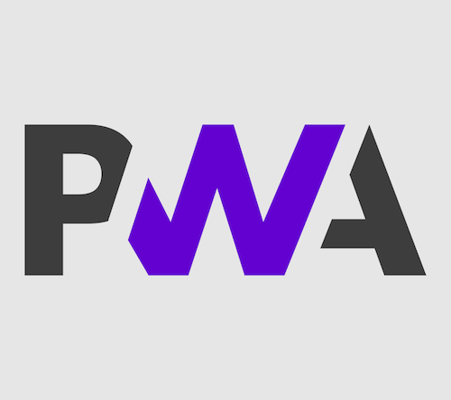
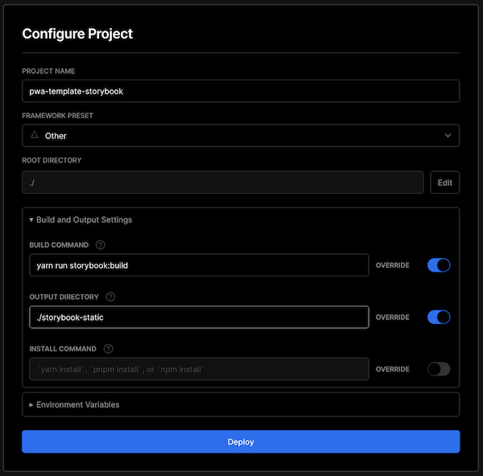

# PWA Template

A template for Next.js with PWA support and i18n.

Try the Demo: https://pwa-template.vercel.app/  
User: Alex  
Password: secret



<h2 align="center">100% Lighthouse score</h2>


<!-- toc -->

- [Libraries](#libraries)
- [Personalize this template](#personalize-this-template)
- [Set up Vercel](#set-up-vercel)
  * [App](#app)
  * [Storybook](#storybook)
- [Setup Sentry](#setup-sentry)
- [Getting started](#getting-started)
- [Atomic design](#atomic-design)
- [Behavior Driven Development](#behavior-driven-development)
- [Test Driven Development](#test-driven-development)
- [Commitlint](#commitlint)
- [Commands](#commands)
- [Skipping linters](#skipping-linters)

<!-- tocstop -->

## Libraries

- [Storybook](https://storybook.js.org/)
- [Cypress](https://cypress.io/)
- [Sentry](https://sentry.io/)
- [Jest](https://jestjs.io/)
- [Commitlint](https://commitlint.js.org/)
- [Eslint](https://eslint.org/)
- [Prettier](https://prettier.io/)

Additional libraries:

- [MUI](https://mui.com/)
- [i18next](https://www.i18next.com/) (via
  [next-i18next](https://github.com/isaachinman/next-i18next))
- [Next Auth](https://next-auth.js.org/)
- [React Hook Form](https://react-hook-form.com/)
- [Zustand](https://zustand-demo.pmnd.rs/)

## Personalize this template

Adjust the information in [pwa.config.mjs](pwa.config.mjs).

Adjust these files:

- `LICENSE`
- `package.json`

## Set up Vercel

This project uses multiple Vercel deployments to make design/code reviews easier:

- App Production
- App Preview
- Storybook Production
- Storybook Preview

Please follow this guide:
[https://vercel.com/docs/concepts/git](https://vercel.com/docs/concepts/git)

### App

Follow the default setup for Next.js.

### Storybook

Adjust the "Build and Output Settings":

- BUILD COMMAND: `yarn run storybook:build`
- OUTPUT DIRECTORY: `./storybook-static`



## Setup Sentry

Please look at [the guide](https://docs.sentry.io/platforms/javascript/guides/nextjs/manual-setup/),
specially the
[configuration](https://docs.sentry.io/platforms/javascript/guides/nextjs/manual-setup/#configure-sentry-cli)
section.

Everything is already set up. You only need to add the correct environmental variables (See
[`.env.local.example`](.env.local.example)).

To test the integration you can visit the
[Sentry sample error page](http://localhost:3000/sentry_sample_error).

## Getting started

**Run the development server:**

```shell
yarn run dev
```

**Run storybook:**

```shell
yarn run storybook
```

## Atomic design

We use atomic design. You can read more about our decision in the
[documentation](docs/ATOMIC_DESIGN.md).

## Behavior Driven Development

We use behavior tests. You can read more about our decision in the
[documentation](docs/BEHAVIOR_DRIVEN_DEVELOPMENT.md).

## Test Driven Development

We use jest to write unit tests. Please look at the Documentation for [Jest](https://jestjs.io/) and
[testing-library](https://testing-library.com/docs/react-testing-library/intro/).

## Commitlint

We use commitlint to ensure conventional commit messages. You can read more about our decision in
the [documentation](docs/COMMITS.md).

## Commands

**Run the development server:**

```shell
yarn run dev
```

**Build:**

```shell
yarn run build
```

**Run storybook:**

```shell
yarn run storybook
```

**Build storybook:**

```shell
yarn run storybook:build
```

**Run cypress tests:**

```shell
yarn run cypress # local without server
# yarn cypress:run # headless
# yarn test:cypress # with server
```

**Run unit tests:**

```shell
yarn run jest
# yarn jest:watch # watch
# yarn test:jest # same as "yarn jest"
```

**Run all tests:**

```shell
yarn run test
```

**Run eslint**

```shell
yarn run eslint
```

**Run all linters**

```shell
yarn run lint
```

## Skipping linters

If you need to skip a linter you can add the `--no-verify` flag.

> :warning: Warning
>
> We strongly advise against skipping linters.

```shell
# Skipping pre-commit hooks
git commit README.md -m "this is a dirty commit" --no-verify
```
